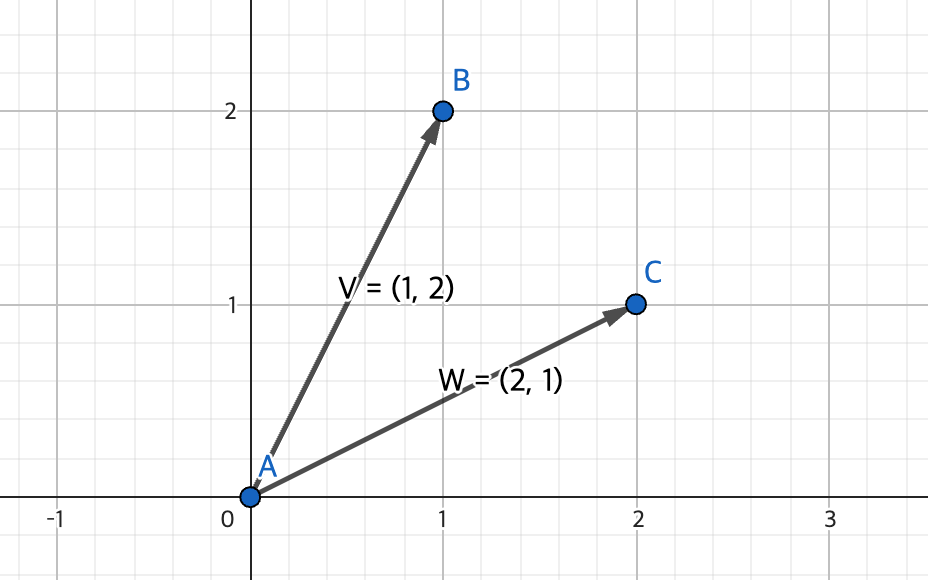
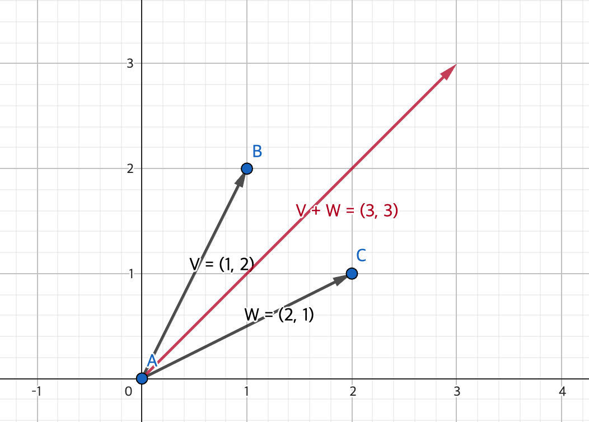
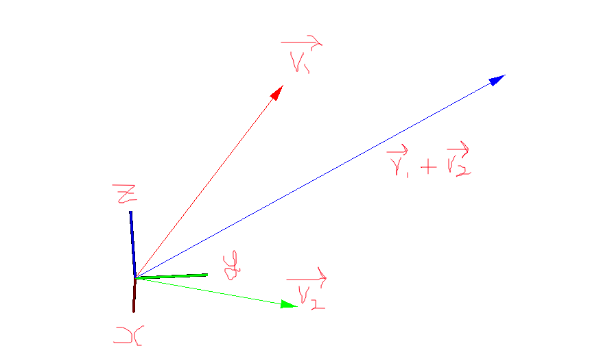

# Vector addition 

This document is for vector addition visualization.

 

## Formula Explanation 

In my code vectors are defined 3D, But since 3D is hard explan.  
So I'll explan the vectors in 2D instead.

  

Defined vector $\vec{v}$, $\vec{w}$

For example, the vectors contain values like 

$\vec{v} = \begin{bmatrix} 1 \\ 2 \end{bmatrix}$, $\vec{w} = \begin{bmatrix} 2 \\ 1 \end{bmatrix}$

  

And the vectors visualization on geogebra

  

### The formula for vector addition 

$\vec{v} + \vec{w} = \begin{bmatrix} 1 + 2 \\ 2 + 1 \end{bmatrix} = \begin{bmatrix} 3 \\ 3 \end{bmatrix}$

In geogebra 

 

## Visualization in cpp on 3D

$\vec{v}$ :: Red  
$\vec{w}$ :: Green  
$\vec{v} + \vec{w}$ :: Blue

